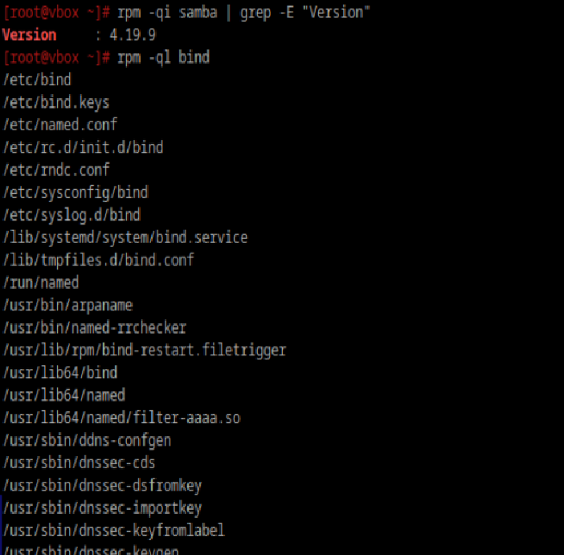
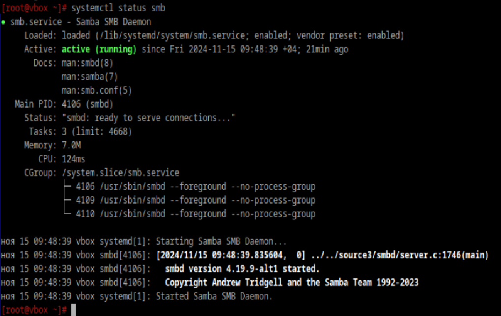
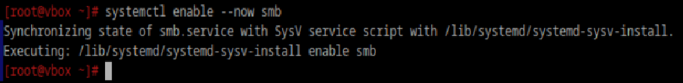
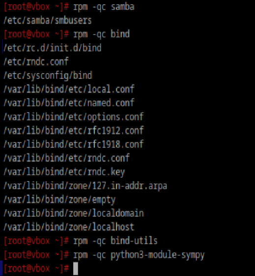

### Установить пакеты samba bind bind-utils и любой питоновский модуль
```
apt-get install samba
apt-get install bind
apt-get install bind-utils
apt-cache search python3-module
apt-get install python3-module-sympy
```

### Вывести: 2.1) Версию 2.2) Файлы пренадлежащие пакету 2.3) Зависимости


```
rpm -qR python3-module-sympy
```

### Проверить службы установленных пакетов, если не запущены - запустить, добавить в автозагрузку



Запуск службы:
```
systemctl start bind
```
Добавление в автозагрузку:
```
systemctl enable bind
```

### Можно ли включить и добавить в автозагрузку одной командой



### Найти и вывести конфигурационные файлы пакетов у которых они есть


