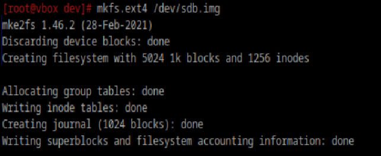
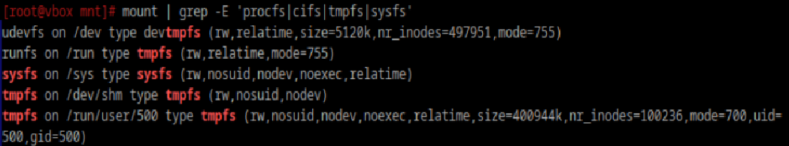
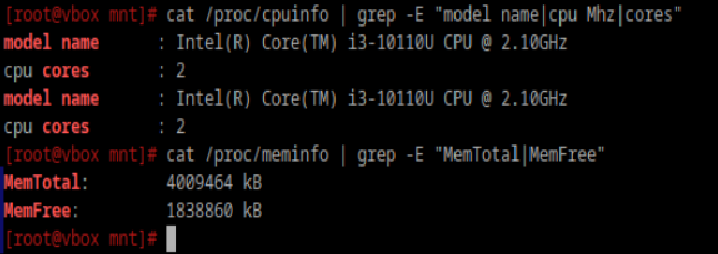

### Какие файловые системы вы знаете?
- **Ext4**: позволяет хранить логи - изменения, обновения файлов данных (записываются в отдельный журнал еще до
  завершения действий) и восстанавливать файлы после перезагрузки ПК
- **XFS**: быстро работает с объемной информацией, способна выделять место для хранения в отложенном режиме
- **Btrfs**: отличается высокой производительностью, легко восстанавливает информацию
- **PROCFS**: создает снимок мгновенного состояния ядра и процессов, которые он контролирует для пространства пользователя
- **SYSFS**(псевдофайловая система): предоставляет интерфейс к структурам данных ядра (файлы и каталоги в sysfs
  позволяют видеть структуры kobject, определенные внутри ядра)
- **Tmpfs**: нужна для размещения пользовательских файлов непосредственно в оперативной памяти ПК

### Как можно классифиировать файловые системы? В чём отличия?
Файловые системы кассифицируются на журналируемые и нежурналируемые. **Журналируемые** сохраняют историю манипуляций 
пользователя и позволяют ее посмотреть, выполнить диагностику системы в отдельном специальном файле.
Отличаются повышенной стойкость к сбоям в функционировании, сохранностью целостности личных данных.
**Нежерналируемые** не предусматривают сбережение логов, не гарантируют сохранность информации, однако работают быстрее.

### Какие файловые системы используются в linux?
Все перечисленные

### Как можно создать файловую систему на диске?



### Как можно подключить диск в систему, что такое монтирование?
Монтирование - это процесс подключения устройства к файловой системе, который позволяет работать с его данными 
как с частью общей структуры каталогов системы. После монтирования устройство становится доступным по 
указанному пути (точке монтирования)
```
mount /dev/sdb /mnt/mydisk
```

### Файловая система procfs, cifs, tpmfs, sysfs. В чём особенности каждой из них? 
|ФС|Тип|Назначение|Точка монтирования|Особенности|
|-|-|-|-|-|
|procfs|Виртуальная|Информация о процессах и системе|/proc|Динамическая, редактируемая|
|cifs|Сетевая|Доступ к сетевым ресурсам Windows|Любой каталог|Протокол SMB, поддержка аутентификации|
|tpmfs|Виртуальная в RAM|Хранение временных файлов|/tmp, /run|Скорость, данные удаляются при перезагрузке|
|sysfs|Виртуальная|Информация об оборудовании и драйверах|/sys|Иерархическая структура, управление оборудованием|

### Вывести каталоги к которым примонтированы эти файловые системы



### Как можно получить информацию о системе используя лишь команду cat? Вывести информацию о процессоре и состоянии памяти системы
```
cat /proc/cpuinfo
cat /proc/meminfo
```


