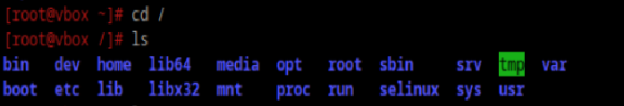

### Какая структура каталогов в linux? Выведите список файлов в корне системы
Адреса всех существующих файлов начинаются с корневой директории /, а дополнительные разделы подключаются к папкам корневого каталога.

### Где хранятся папки пользователей в системе?
/home

### Где домашняя папка суперпользователя?
/root

### Где хранятся основые конфигурационные файлы в системе?
/etc

### Что за папки /bin, /sbin, /usr/bin, /usr/sbin
/bin содержит большую часть пользовательских программ, /sbin - то же самое + для суперпользователя

/usr/bin, /usr/sbin - ссылки на эти каталоги
