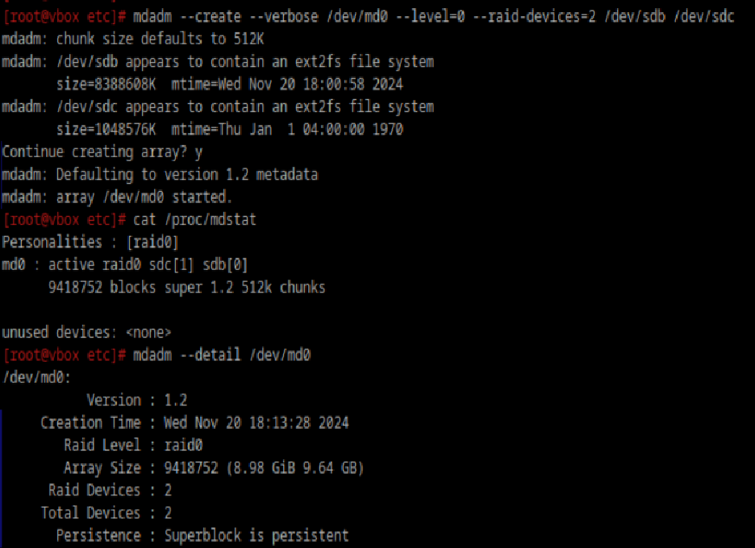
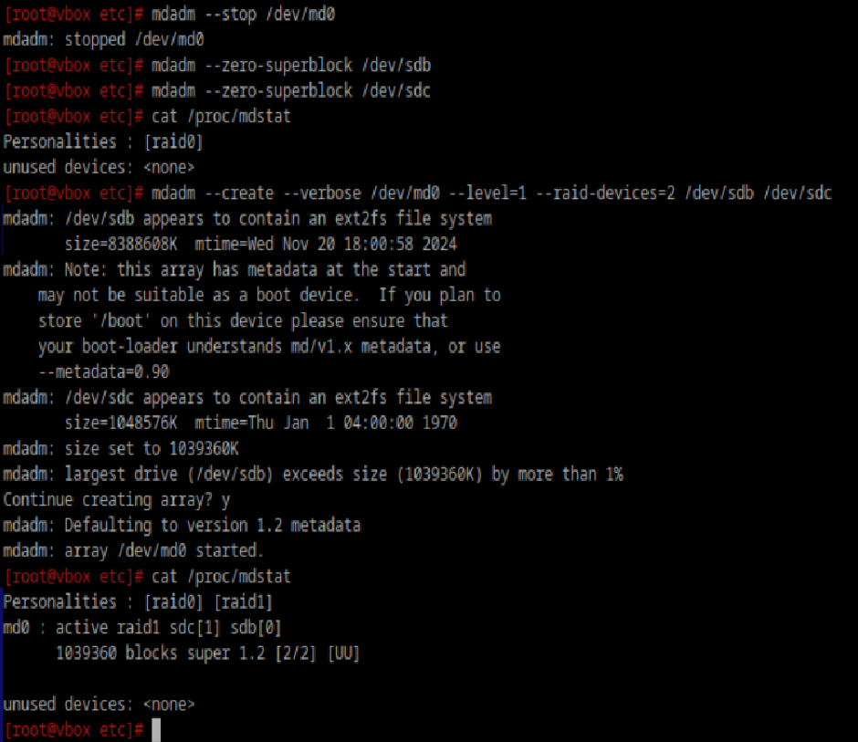

### Raid массивы, что такое икакие бывают
RAID (Redundant Array of Independent Disks) — это технология объединения нескольких жестких дисков в один логический 
объем для повышения производительности и/или надежности. RAID может использоваться для защиты данных от потери, а также 
для увеличения скорости чтения и записи данных.

1. **RAID 0** (Striping): Данные разбиваются на блоки и распределяются по всем дискам;
2. **RAID 1** (Mirroring): Данные дублируются на двух или более дисках;
3. **RAID 5**: Используется минимум три диска. Данные и контрольные суммы (паритет) распределяются по всем дискам;
4. **RAID 6**: Подобен RAID 5, но используется два набора контрольных сумм, что позволяет выдерживать выход из строя двух дисков;
5. **RAID 10 (или RAID 1+0)**: Комбинирует RAID 0 и RAID 1. Данные сначала зеркалируются, а затем распределяются;
6. **RAID 1E**: Улучшенный вариант RAID 1, в котором данные тоже зеркалируются, но с более эффективным использованием
   дискового пространства;
7. **RAID 50**: Комбинация RAID 5 и RAID 0. Содержит как паритет (RAID 5), так и распределение данных (RAID 0), обеспечивая
   как производительность, так и безопасность;
8. **RAID 60**: Подобен RAID 6, но включает в себя распределение данных (RAID 0) для повышения производительности.

### Добавьте в виртуальную машину 2 диска отформатируйте их в ext4. Создайте из них raid 0 массив

Перед созданием raid массива необходимо размонтировать все диски.

### Удалите raid0 и создайте raid1

### Есть ли файловые системы которые поддерживают raid массивы без стороненго ПО
Btrfs позволяет создавать RAID массивы (RAID 0, RAID 1, RAID 10 и т.д.) и управлять ими без использования утилит типа `mdadm`.

### Можно ли создать raid массив во время установки системы?
В **Ubuntu** в процессе установки можно выбрать опцию «Установить RAID», где можно создать массивы и выбрать их для 
установки системы.

**Debian** поддерживает настройку RAID с помощью установщика.

**Fedora** и **CentOS** поддерживают создание RAID массивов на этапе установки через разделение диска.
