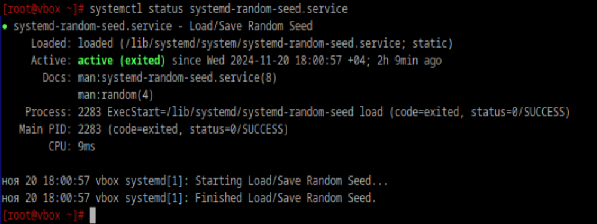
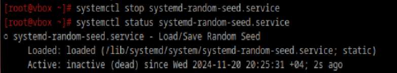

### Что такое systemd юнит?
Юниты - это файлы, из которых systemd берет информацию о том, какие процессы ему необходимо исполнить.
Юнитами могут быть, например, службы (.service), точки монтирования (.mount), устройства (.device) или сокеты (.socket).

### Проверьте статус любого systemd юнита, какую информацию выводит эта команда?

Loaded: Статус загрузки юнита (загружен или не загружен) и абсолютный путь

Active: Текущий статус службы

Docs: мануалы

Process: Имя основного процесса, который управляется сервисом

Main PID: Уникальный идентификатор сервиса

CPU: Текущее использование процессора сервисом 

### Попробуйте оставновить сервис

### Перезапустите его
`systemctl restart systemd-random-seed.service`

### Удалите из автозагрузки
`systemctl disable systemd-random-seed.service`

### Верните обратно
`systemctl enable systemd-random-seed.service`

### Что такое таймеры?
Таймеры - файлы юнитов systemd, имя которых имеет суффикс .timer; они позволяют контролировать файлы .service или события
