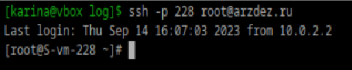
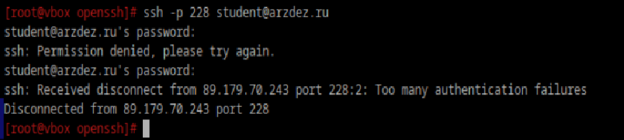
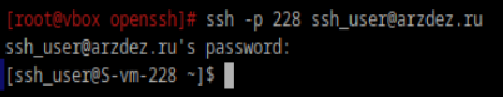

### Какой по умолчанию используется порт для поключения
Port 22

### Можно ли его изменить? если да то как?
Изменить файл /etc/openssh/ssh_config
Заменить Port 22 на более высокий номер (Port 2222)

### Какая служба отвечает за обработку запросов на подключения по ssh?
sshd.service

### Какой файл конфигурации отвечает за его настройку?
/etc/openssh/sshd_config

### Отредактируйте файл настроек на сервере так, чтобы была возможность подключиться к серверу используя пользователя root
Добавить строчку `PermitRootLogin yes`

Раскомментировать строчку `PubkeyAuthentication yes` и после нее еще две длинные `PubkeyAcceptedKeyTypes <...>` и `AuthorizedKeysFile <...>`

Предварительно сгенерировать ssh ключ в своей локальной учетке командой `ssh-keygen -t rsa`, скопировать его и вставить на сервере в файл /root/.ssh/authorized_keys

### Измените колличество ошибок ввода пароля перед сборосом соединения, покажите эти измененения
Добавить в файл /etc/openssh/sshd_config строчку `MaxAuthTries 2`

MaxAuthTries Указывает максимальное количество попыток аутентификации. По умолчанию - 3

### Создайте пользователя ssh-user и попробуйте им подключиться к серверу

### Ограничте ему возможность подключения к серверу
Добавить в файл строчку `DenyUsers ssh-user`

или выполнить:

`sudo usermod -s /usr/sbin/nologin ssh_user`
