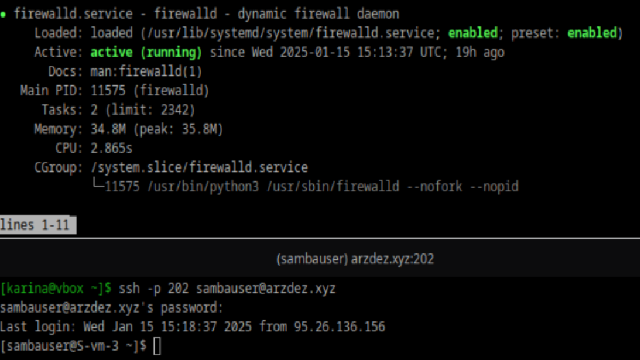
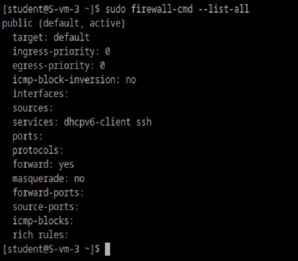
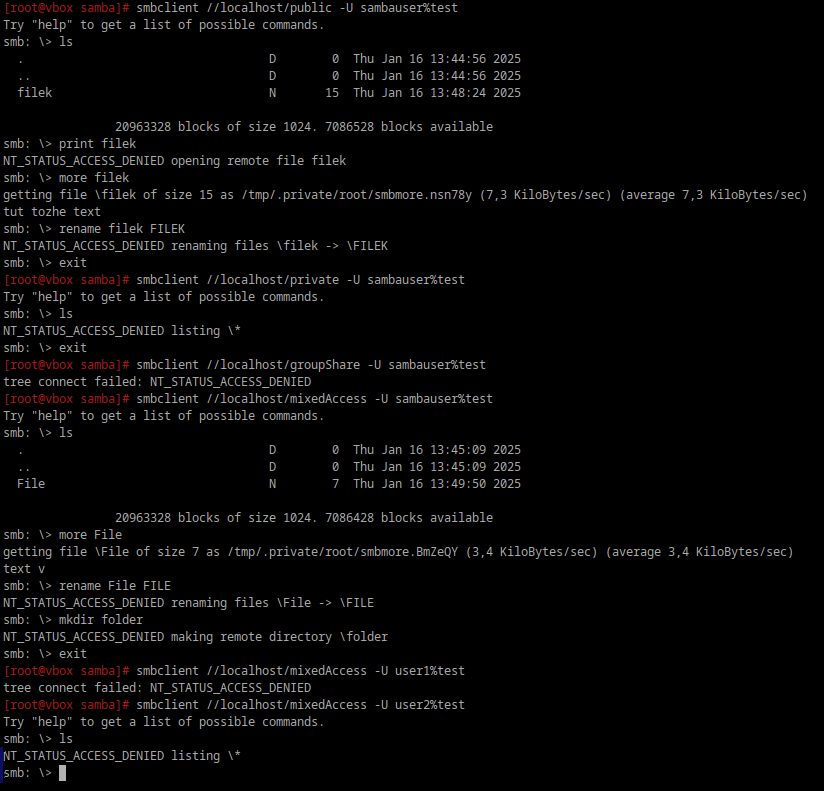

### Удалите iptables и установите firewalld
```
sudo systemctl stop iptables
sudo systemctl disable iptables
sudo apt-get remove iptables
sudo apt-get install firewalld
```

### Попробуйте так-же проверить возможность подключения по ssh


### Выведите список открытых портов с помощью firewall-cmd


### Можно ли там добавить порты по названию сервиса?
Да, командой `firewall-cmd --add-service=*название_сервиса*`

### На вашей Локальной виртуальной машине попробуйте подключиться к серверу samba из предыдущих заданий


### Сделайте так чтобы изменения были постоянными
`firewall-cmd --*какая-то команда* --permanent`
